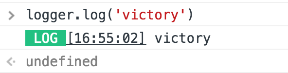
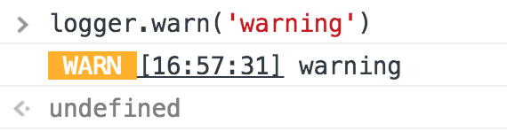
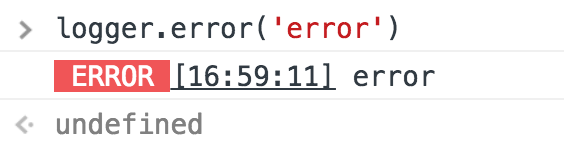
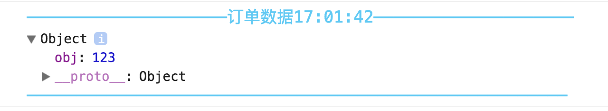

# JS Logger

> 好看的、好用的、清晰的log信息

## Installing

Using npm:

```bash
$ npm install --save-dev @woolson/logger
```

Using original:

```html
<script src="../somepath/logger.min.js"></script>
```

## Config

- #####`debugTitleSize`
	debug模式 title的字体大小，默认大小`14`
- #####`colored`
	是否使用颜色，默认使用`true`
- #####`dateTemp`
	`log`的时间格式，默认`HH:mm:SS`，具体配置可参考 [moment](http://momentjs.cn/docs/#/displaying/)（部分支持）
- #####`logLevel`
	控制哪些log是可以显示出来，可用于区别本地和线上，默认所有  
	可选 `log`,`warn`,`error`（`debug`）在`log`等级才会显示

## Methods

- #####`log`

```javascript
logger.log('Hello world')
```



- #####`warn`

```javascript
logger.warn('Hello world')
```



- #####`error`

```javascript
logger.error('Hello world')
```



- #####`debug`

可在`debug`时候使用，颜色随机以便区分区域

```javascript
logger.debug('Hello world')
logger.debug('订单数据', {obj: 123})
```




## Example

传统项目

```javascript
// 可在初始化的时候配置
var logger = new Logger({})
// 具体方法
logger.log('Hello world')
logger.warn('Hello world')
logger.error('Hello world')
logger.debug('title', 'Hello world') or logger.debug('Hello world')
```

Vue项目中

```javascript
import Logger from '@woolson/logger'

// 可在初始化的时候配置
Vue.use(Logger, config)

// 可以再每个组件中使用
this.$log('Hello world')
this.$warn('Hello world')
this.$error('Hello world')
this.$debug('title', 'Hello world') or this.debug('Hello world')
```

----
[woolson](http://woolson.github.io)