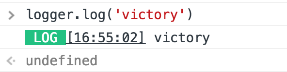
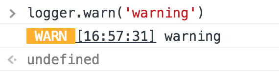
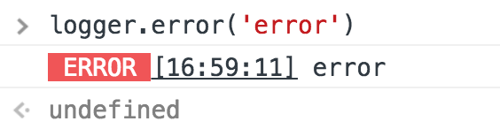
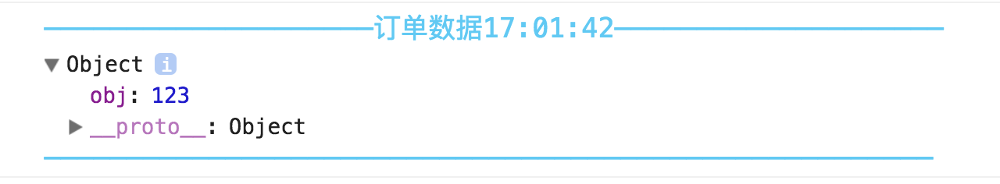
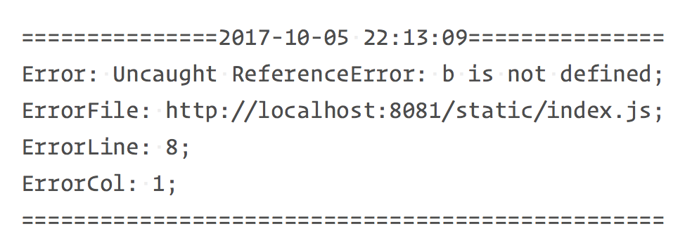

# JS Logger | JS日志

> 好看的、好用的、清晰的log信息

## Installing

使用npm（推荐）:

```bash
$ npm install --save-dev @woolson/logger
```

HTML引入:

```html
<script src="../somepath/logger.min.js"></script>
```

## 示例

传统项目

```javascript
// 可在初始化的时候配置
var logger = new Logger({})
// 具体方法
logger.log('Hello world')
logger.warn('Hello world')
logger.error('Hello world')
logger.debug('title', 'Hello world') or logger.debug('Hello world')
logger.server(data)
```

Vue项目中

```javascript
import Logger from '@woolson/logger'

// 可在初始化的时候配置
Vue.use(Logger, config)

// 可以再每个组件中使用
this.$log('Hello world')
this.$warn('Hello world')
this.$error('Hello world')
this.$debug('title', 'Hello world') or this.debug('Hello world')
logger.$server(data)
```

## TODO

- 收集错误和提升体验

## 配置

<table className="global-table">
  <thead>
    <tr>
      <th>配置</th>
      <th>类型</th>
      <th>描述</th>
    </tr>
  </thead>
  <tbody>
    <tr>
      <td>colored</td>
      <td>Boolean</td>
      <td>是否使用颜色，默认true</td>
    </tr>
    <tr>
      <td>logLevel</td>
      <td>String</td>
      <td>log、 warn、 error（debug）在log等级才会显示，默认log</td>
    </tr>
    <tr>
      <td>dateTemp</td>
      <td>String</td>
      <td>log的时间格式，默认HH:mm:SS，具体配置可参考<a href="http://momentjs.cn/docs/#/displaying/">moment</a>（部分支持）</td>
    </tr>
    <tr>
      <td>debugTitleSize</td>
      <td>Number</td>
      <td>debug模式标题的字体大小，默认大小14</td>
    </tr>
    <tr>
      <td>catchErrorUrl</td>
      <td>String</td>
      <td>server方法把错误信息传到后端的接口</td>
    </tr>
  </tbody>
</table>

## 方法

#### log

```javascript
logger.log('Hello world')
```



#### warn

```javascript
logger.warn('Hello world')
```



#### error

```javascript
logger.error('Hello world')
```



#### debug

可在`debug`时候使用，颜色随机以便区分区域

```javascript
logger.debug('Hello world')
logger.debug('订单数据', {obj: 123})
```



#### server

收集用户端的错误信息，可尽快知晓和定位错误

客户端
```javascript
logger.server(data)
```
服务端
```javascript
// /api/catchError 为配置中的接口
app.post('/api/catchError', function (req, res) {
	var body = req.body
	var logPath = path.join(__dirname, '/static/error.log')
	var date = utils.moment.getCurrent('YYYY-MM-DD HH:mm:SS')
	var content = [
		`${'='.repeat(15)}${date}${'='.repeat(15)}\n`,
		`Error: ${body.msg};\n`,
		`ErrorFile: ${body.url};\n`,
		`ErrorLine: ${body.line};\n`,
		`ErrorColumn: ${body.col};\n`,
		`${'='.repeat(49)}\n\n\n`,
	]
	fs.appendFileSync(logPath, content.join(''))
	res.send({success: true})
})
```



----
[woolson](http://woolson.github.io)
